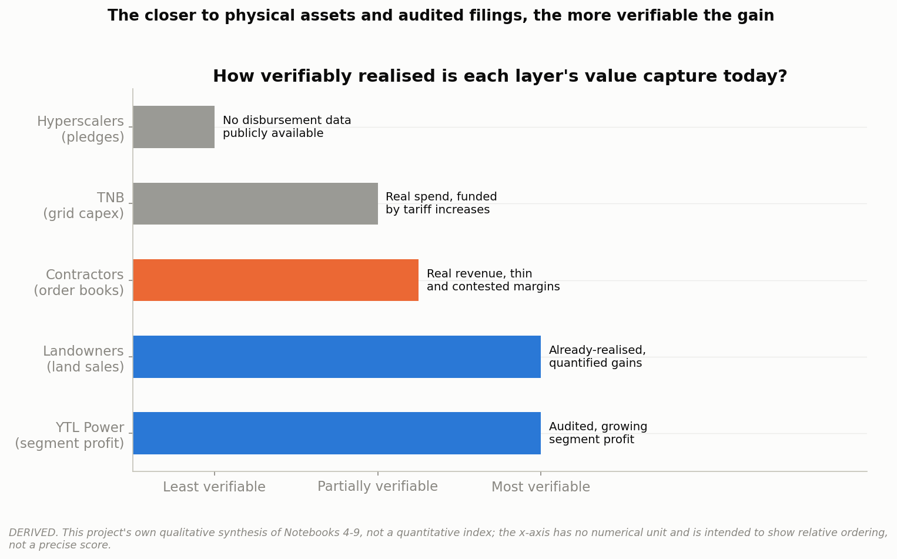

# Project 011: Malaysia's AI Data Centre Boom

### Committed Capacity vs. Real Demand



**Part of a [11-case-study portfolio](https://github.com/ooi-darren)**, and the first case study in this portfolio centred on infrastructure and energy rather than a single company or product market.

> A stretch of former oil-palm land on the Johor-Singapore border has become one of Southeast Asia's fastest-growing data centre markets, with Malaysia's own grid operator disclosing that only 15% of secured capacity is actually drawing power. Is this a real, fast-scaling economic boom, or a pipeline of announcements running well ahead of reality, and who is actually capturing value from it?

## Recommendation

**Treat Malaysia's AI data centre boom as a genuine, fast-scaling economic activity that is still meaningfully ahead of its own realised demand, unevenly distributed in who actually benefits from it today, and only partly reassured by government restraint that does not directly touch the boom's own AI-linked core.** TNB's own disclosures show 8.35GW secured but only 1.26GW actually drawn (15% of secured, 22% of connected capacity, Notebook 3); a previously unannounced government policy has quietly filtered new non-AI applications for roughly two years (Notebook 3), real evidence of institutional restraint, but not proof the AI-linked pipeline behind the utilisation gap is itself curated, since that category was explicitly exempted from the filter. A business or investor evaluating this space should weight audited, realised-value layers, YTL Power's real segment profit (Notebook 5), landowners' already-quantified gains (Notebook 7), contractors' signed revenue (Notebook 6), more heavily than the widely-quoted hyperscaler pledge totals (Notebook 8), which remain fundamentally unverifiable with public information regardless of how large they sound.

**On the constraints that could slow this down**, the water and grid pressures documented in this project (Notebooks 4, 10, 11) are real, already producing concrete policy responses (Johor's Tier 1/2 facility ban, a 2027 wait for water-intensive cooling approval) and at least one real community conflict (the February 2026 Gelang Patah protest), not distant hypothetical risks. TNB's own grid officials describe data centres as "a new animal" they cannot yet fully see or manage, a genuine operational concern from the people running the actual power grid, not just cautious investor-relations language.

## Executive Summary

This project traces Malaysia's AI/hyperscaler data centre boom from its geographic and policy origins (why Johor specifically, not another part of Malaysia or the region, Notebook 1) through the exact scale of its build-out (national capacity roughly doubling annually, Johor's own pipeline three times what is already built, Notebook 2), into a direct reconciliation of how much of that committed capacity is actually being used. Tenaga Nasional Berhad's own 2Q FY2026 disclosures show 61 secured data centre projects (8.35GW) against only 42 grid-connected (5.65GW) and 1.26GW of actual load utilisation, a genuine gap this project reports on both denominators rather than picking whichever tells a cleaner story (Notebook 3). A previously undisclosed fact adds real but partial context: Prime Minister Anwar Ibrahim confirmed in parliament that Malaysia has informally blocked new non-AI data centre applications for roughly two years, genuine evidence of institutional restraint, though the filter explicitly exempts AI-linked applications, the category actually driving this pipeline, so it does not by itself establish that the AI-driven demand behind the utilisation gap is curated (Notebook 3). TNB itself is funding a RM42.8 billion three-year grid capex programme partly through tariff increases on these same customers, with no special "data centre tariff" but a real cost impact of an estimated US$15-20 million per year for a 100MW facility (Notebook 4). Among every company touched by this boom, only YTL Power International discloses a genuine, audited data centre segment, whose profit grew roughly tenfold to RM345.5 million in FY2026, a small share of group revenue (3.9%) but an outsized share of group profit (14.4%), earned in a year when the rest of YTL Power's group profit fell 27.6% (Notebook 5). Construction contractors show real but highly uneven exposure, and the commonly assumed "data centre construction is higher-margin" narrative does not hold up against the companies' own guidance (Notebook 6). Landowners already have concrete, company-quantified gains locked in, one EcoWorld land sale alone is expected to lift its FY2027 profit by up to 26%, even though the accounting profit itself lands in a future fiscal year (Notebook 7), while hyperscaler pledges exceeding $23 billion combined have no public disbursement data attached to any of them (Notebook 8). A value-capture synthesis across all these layers (Notebook 9) finds landowners and YTL Power hold the most verifiable gains, TNB's position is better described as regulated cost recovery than open-ended upside, and hyperscalers hold the least verifiable position despite generating the largest headline numbers. Real water (Notebook 10) and grid (Notebook 11) constraints are already producing policy responses and a documented community protest, evidence this boom's physical costs are landing on real infrastructure and real people today, not just a future planning concern.

## Research Question

**Is Malaysia's AI data centre boom generating real, verifiable economic activity today, or is it still mostly a pipeline of commitments running ahead of actual demand, and across the companies and government bodies involved, who is actually capturing value from it?**

## Key Findings

**1. Most secured capacity is not yet drawing power, but the gap is closing.** TNB's 2Q FY2026 disclosure: 61 secured projects (8.35GW), 42 connected (5.65GW), 1.26GW actually utilised, 15.1% of secured and 22.3% of connected capacity (Notebook 3).

**2. A previously undisclosed government policy has been actively filtering this pipeline for two years.** PM Anwar Ibrahim confirmed in a 24 February 2026 parliamentary session that Malaysia has informally blocked new non-AI data centre applications since roughly mid-2024, while continuing to approve AI-linked ones (Notebook 3).

**3. Only one company in this entire ecosystem discloses a genuine, audited data centre segment.** YTL Power's Data Center segment profit grew from RM32.1 million to RM345.5 million in one year, but was only broken out as a standalone segment starting with the FY2026 annual filing (Notebook 5).

**4. That growth happened while the rest of YTL Power's group profit fell sharply.** Group-wide profit before tax fell 27.6% in FY2026, driven by a 47% collapse in the Power Generation segment, a genuine tension worth stating alongside the data centre growth story (Notebook 5).

**5. The "data centre construction is higher-margin" narrative doesn't hold up.** Sunway Construction's own guided margin range puts data centre work at the upper end of its normal 5-8% PBT margin, not distinctly above it (Notebook 6).

**6. Landowners already have concrete, company-quantified gains locked in.** EcoWorld's single 49.6-acre Kulai land sale (RM280.8 million) is expected to lift its FY2027 profit by 18-26% on its own, a real figure even though the accounting profit lands in a future fiscal year, not the current one (Notebook 7).

**7. Hyperscaler pledges exceed $23 billion combined, with zero public disbursement data.** AWS, Oracle, Nvidia, Microsoft, ByteDance, and Google have all made real, on-the-record pledges, but none files a Malaysia-specific segment, so none can be checked against how much has actually been spent (Notebook 8).

**8. MIDA's RM385.7 billion and Bank Negara's RM14.1 billion figures are not the same kind of number, and should not be compared as a "gap."** One is a cumulative multi-year investment-approval pipeline; the other is a single year's GDP-contribution estimate from a different institution (Notebook 9).

**9. Data centres overtook manufacturing as Malaysia's top source of net FDI within three years.** Their share of net FDI inflows rose from 4% (2022) to 51% (2024) (Notebook 1).

**10. Johor's water constraint is real and already producing policy action, not a distant risk.** Johor banned older, water-inefficient facility tiers outright in November 2025, and a real community protest occurred in Gelang Patah in February 2026 over a specific facility under construction (Notebook 10).

**11. Johor is catching up to Singapore fast, but Singapore remains larger today.** Johor's 850MW built capacity trails Singapore's ~1.4GW operational base, but Johor has added more capacity in 2-3 years than Singapore's entire tightly-rationed expansion since its own 2019-2022 moratorium ended (Notebook 11).

## Explain It Simply

A stretch of land near the Johor-Singapore border that used to grow oil palm has, in the space of a few years, become one of the hottest data centre construction zones in Southeast Asia, with tens of billions of dollars in announced investment from the world's biggest tech companies. This project checked how much of that is actually real economic activity happening today, versus still just plans and promises. The honest answer is both, in different amounts depending on who you're looking at. Malaysia's own grid operator says only about a fifth of the electricity capacity data centres have signed up for is actually being used right now, and a surprising fact this project uncovered explains part of why: the government has quietly been turning away new non-AI-related data centre applications for about two years already, something that was never announced publicly until a politician was asked about it directly in parliament. Among the companies involved, some are clearly making real money today, a land-selling developer, and the one power company that actually reports its data centre profits honestly, while the biggest headline numbers, the multi-billion-dollar pledges from companies like Amazon and Microsoft, are ironically the hardest to verify at all, because none of them has to publicly report how much of that promised money has actually shown up in Malaysia. Meanwhile, this boom is already creating real friction on the ground: Johor has had to ban older, thirstier types of data centres to protect its water supply, and in February 2026 a group of residents protested a data centre being built right next to their homes.

(New to terms like "hyperscaler," "PUE," or "ESA"? See the Glossary near the bottom.)

## Why This Research Matters

Most news coverage of Malaysia's data centre boom either repeats the biggest headline investment figures uncritically, or treats the whole ecosystem as a single undifferentiated story. This project pulled TNB's own disclosed grid data, YTL Power's actual audited segment financials, individual Bursa Malaysia contract announcements for three major construction groups, and a government parliamentary record revealing a previously unannounced policy, to build a genuine, sourced picture of what is real today versus what remains a pipeline of commitments, following the same PUBLIC/DERIVED/ESTIMATED sourcing discipline as every other case study in this portfolio, and disclosing plainly where a widely-repeated figure could not be independently verified (a Johor land-price trend statistic, a claim about paused gas-fired power capacity) rather than passing it through uncritically.

## Notebooks

| # | Question | Data Rigor |
|---|---|---|
| [01: Why Malaysia, Why Johor](./notebooks/01_why_malaysia_why_johor.ipynb) | What actually pulled this investment to one specific stretch of land? | PUBLIC |
| [02: The Capacity Build-Out](./notebooks/02_capacity_buildout.ipynb) | How fast is capacity actually being built, and how concentrated in Johor? | PUBLIC |
| [03: The Utilisation Gap](./notebooks/03_the_utilisation_gap.ipynb) | How much of the committed capacity is actually being used? | PUBLIC |
| [04: TNB's Own Economics](./notebooks/04_tnb_economics.ipynb) | What is this actually costing the grid operator, and how is it priced? | PUBLIC |
| [05: YTL Power International](./notebooks/05_ytl_power.ipynb) | What does the one fully-disclosed operator's real performance show? | PUBLIC |
| [06: The Contractors' Economics](./notebooks/06_contractor_economics.ipynb) | How exposed is each construction group, and is this really higher-margin work? | PUBLIC + DERIVED |
| [07: The Land Story](./notebooks/07_land_story.ipynb) | Who is capturing value at the ground level, before a server is even switched on? | PUBLIC |
| [08: The Hyperscalers](./notebooks/08_the_hyperscalers.ipynb) | How solid are the biggest headline pledge numbers, really? | ESTIMATED |
| [09: Who Actually Captures the Value](./notebooks/09_value_capture_scorecard.ipynb) | Across every layer, who is verifiably getting paid today? | PUBLIC + DERIVED |
| [10: The Water Constraint](./notebooks/10_water_constraint.ipynb) | How real is the water constraint, and is it slowing the boom down? | PUBLIC |
| [11: Regional Competitive Position](./notebooks/11_regional_position.ipynb) | Is Johor really overtaking the region, and is the grid showing strain? | PUBLIC |
| [12: Synthesis and Recommendation](./notebooks/12_synthesis_and_recommendation.ipynb) | Pulling it all together: real boom, or pipeline of promises? | DERIVED |

## Methodology

Full sourcing discipline follows this portfolio's standing convention: every figure classified PUBLIC / DERIVED / ESTIMATED, primary or independently-verified sources preferred over single-source secondary claims, and every figure paired with compliance context and a direct reference, checked proactively during research rather than as a cleanup step. Five parallel research passes were run before any notebook was built, each verifying a different slice of the project (TNB's grid disclosures, YTL Power's segment financials, contractor order books, MIDA/land/hyperscaler figures, and the water/regional picture) against primary or independently-corroborating sources rather than relying on a single secondary summary.

A genuine compliance issue was found and resolved the same way this portfolio handled a similar case in project 010: **TNB's own website terms of use explicitly prohibit reproduction of its content** ("The reproduction of the contents of this website in part or in its entirety is prohibited... without the prior written consent of TNB"). Every TNB-originated figure in this project (Notebooks 2, 3, and 4) is therefore cited to independent news outlets and research notes that separately report the same disclosures (The Star, The Edge, Reuters, BusinessToday, RHB, moomoo), or to a government document carrying no such restriction (a Parliamentary written answer), rather than to TNB's own PDFs directly.

A second compliance check found that **both JLL Malaysia's and Bank Negara Malaysia's own website terms of use also restrict reproduction of their content** without permission (JLL: "No materials from the Website may be copied, reproduced, republished, uploaded, posted, or distributed in any medium unless specifically authorized"; BNM: "User shall not modify, publish, transmit... or in any way exploit or reproduce, any of the content of BNM website, in whole or in part"). This matters here because Bank Negara Malaysia's Q3 2025 Quarterly Bulletin box article is this project's single most-cited source (Notebooks 1, 2, 4, 9, and 10). Neither restriction is treated as blocking this project: no PDF, report, or bulletin from either source is stored in this repository, and every citation extracts a specific, individually-attributed statistic (a capacity figure, an FDI share, a wage range) rather than reproducing the reports' own text, structure, or analysis, the same standard practice a news article or academic paper uses when citing a government statistic. This distinction, and the fact that no source document is redistributed, is stated explicitly here rather than left implicit.

Two widely-repeated claims were deliberately excluded rather than passed through unverified: a Johor industrial land-price trend statistic (Notebook 7) and a claim about a multi-year pause in new gas-fired power capacity (Notebook 11), both because this project could not trace them back to a primary or clearly-sourced document during research. A frequently-implied "gap" between two large investment figures, MIDA's RM385.7 billion cumulative approved investment and Bank Negara Malaysia's RM14.1 billion GDP-contribution estimate, was investigated and found to be a genuine unit mismatch between two different institutions' metrics, not a real discrepancy, and is reported as such rather than as a manufactured finding (Notebook 9).

## Data Sources

Bank Negara Malaysia, "From Bytes to Bucks: The Economics of Data Centres in Malaysia," Quarterly Bulletin Q3 2025 box article (primary government analysis; BNM's own terms restrict reproduction of its content, see Methodology for how this is handled); TNB analyst briefings and quarterly results, as independently reported by RHB/i3investor, BusinessToday, and moomoo (TNB's own site is not directly reproduced, see Methodology); YTL Power International Berhad FY2026 Annual Interim Report (primary regulatory filing); Keppel Ltd FY2025 results, as independently reported (competitor benchmark, Notebook 5); individual Bursa Malaysia contract announcements for Sunway Construction Group, Gamuda Berhad, and IJM Corporation, 2024-2026; a written Parliamentary answer from the Ministry of Energy Transition and Water Transformation, 6 July 2026, citing JPPPET No 1/2026; EcoWorld, Princeton Digital Group, and UEM Sunrise press releases (land transactions); hyperscaler press releases (AWS, Microsoft, Google, Oracle, Nvidia, ByteDance); JLL Malaysia data centre market report (capacity figures, cited as attributed-secondary; JLL's own terms also restrict reproduction, see Methodology); w.media trade publication reporting (water constraint figures, sourced to Indah Water Konsortium and Johor state government statements); South China Morning Post (Gelang Patah protest, February 2026); Eco-Business and TransitionZero analyses citing TNB data (grid-strain figures independent of TNB's own framing). Full inline citations in each notebook's closing "Sources" cell.

## Limitations

Five research forks verified this project's figures against primary or independently-corroborating sources, but several gaps remain, disclosed explicitly rather than silently: **YTL Power's regional competitor benchmark is real but imperfect** (Keppel Ltd's Connectivity segment is a broader, mixed segment that includes submarine cables alongside data centres, not a pure like-for-like comparison; ST Telemedia has no usable public financials at all since its 2026 privatisation, Notebook 5); **IJM Corporation's order-book figures conflict across sources by date** and were not fully reconciled: this project used the most recent consistent figure rather than averaging conflicting numbers (Notebook 6); **no disbursement-to-date data exists publicly for any hyperscaler pledge**, meaning the true scale of capital actually deployed in Malaysia by any of the six hyperscalers covered cannot currently be measured from public information (Notebook 8); **a widely-repeated Johor land-price trend figure could not be verified** to this project's sourcing standard and was excluded rather than passed through (Notebook 7); **one claim about a multi-year pause in new gas-fired power capacity could not be verified** (a source fetch failed) and was excluded (Notebook 11); **two similarly-scoped figures for data centres' 2026 share of Malaysia's electricity, 7% of forecast demand (Notebook 4, a government planning document) versus 9.28% of actual consumption (Notebook 11, independent press citing TNB)** were not fully reconciled, since they measure different things (a forecast versus a real-time figure) from different sources; and **the per-facility water-use figures are well-corroborated industry estimates, not a single primary engineering study** (Notebook 10). This project also describes an active, evolving policy environment (the informal application moratorium, Johor's water-tier rules) as of publication; some of these positions may have changed by the time this is read.

## Glossary

Plain-language definitions for the technical terms used in this project.

- **Data centre**: a purpose-built facility housing servers and networking equipment, used to run cloud computing, AI, and internet services.
- **Hyperscaler**: a very large cloud provider (Amazon Web Services, Microsoft Azure, Google Cloud, and similar) that builds and operates data centres at massive scale.
- **Electricity Supply Agreement (ESA)**: a contract between TNB and a customer specifying the maximum electricity demand TNB agrees to supply.
- **Secured / connected / utilised capacity**: three distinct measures of a data centre's power status, contracted on paper, physically grid-connected, and actually drawing electricity, in ascending order of how "real" the demand currently is.
- **Regulatory Period (RP)**: a multi-year cycle (currently RP4, 2025-2027) under which Malaysia's Energy Commission sets TNB's allowed revenue, capital spending, and tariffs.
- **Segment reporting**: the accounting practice of breaking a company's financial results into distinct business lines rather than reporting only a single consolidated total.
- **Order book / tender book**: the value of contracts a construction company has already been awarded (order book) versus bid on but not necessarily won (tender book, a larger, less certain figure).
- **Power Usage Effectiveness (PUE)**: a measure of a data centre's energy efficiency; a lower number is more efficient.
- **JS-SEZ (Johor-Singapore Special Economic Zone)**: a 2025 bilateral economic zone agreement between Malaysia and Singapore covering the Johor border region.
- **PUBLIC / DERIVED / ESTIMATED**: How traceable a number in this project is. **PUBLIC** = taken directly from an official source or independently-corroborated company disclosure. **DERIVED** = built by combining, calculating, or extracting from PUBLIC sources this project directly checked. **ESTIMATED** = based on a company announcement or secondary source that could not be independently audited or verified.

## Reproducibility

```bash
pip install -r requirements.txt
jupyter notebook notebooks/
```

All processed data (the SQLite database and CSVs in `data/processed/`) is committed to this repository. Raw source documents (analyst briefings, reports) are kept locally for verification but not committed, both because TNB's own site prohibits reproduction of its content, and consistent with this portfolio's general practice of citing extracted figures with attribution rather than redistributing whole third-party documents verbatim.

## Project Structure

```
malaysia-ai-data-centre-boom/
├── README.md
├── data/
│   ├── raw/              # Not committed, see Reproducibility
│   └── processed/        # SQLite database and CSVs, the actual data this project computed
├── notebooks/             # 01-12, narrative walkthrough
├── python/
│   └── visualisation/      # House chart style
├── outputs/
│   └── figures/             # 12 PNG visualisations
├── requirements.txt
├── LICENSE
└── .gitignore
```

## Sources

Full inline citations with links in each notebook's closing "Sources" cell.

## Author

Darren Ooi, [LinkedIn](https://www.linkedin.com/in/darrenooizhixian)
